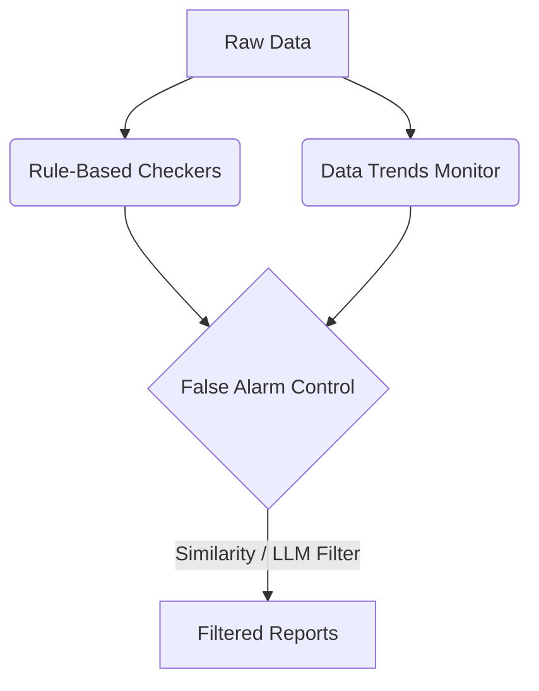
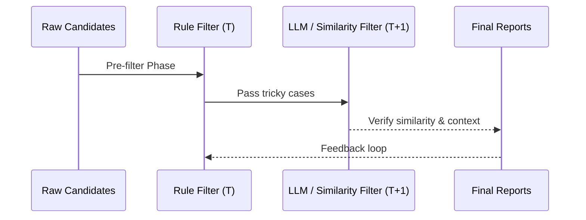
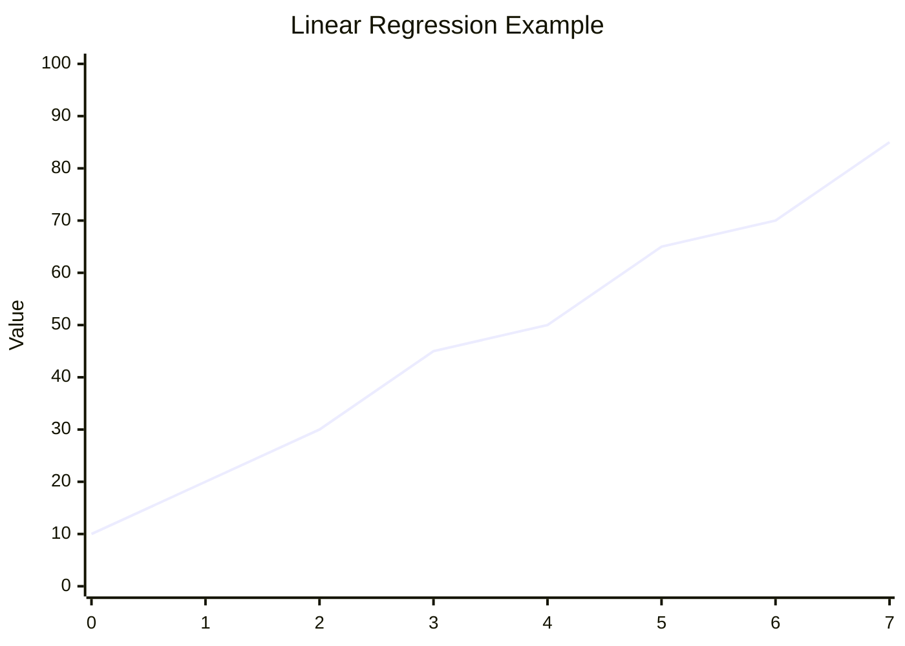
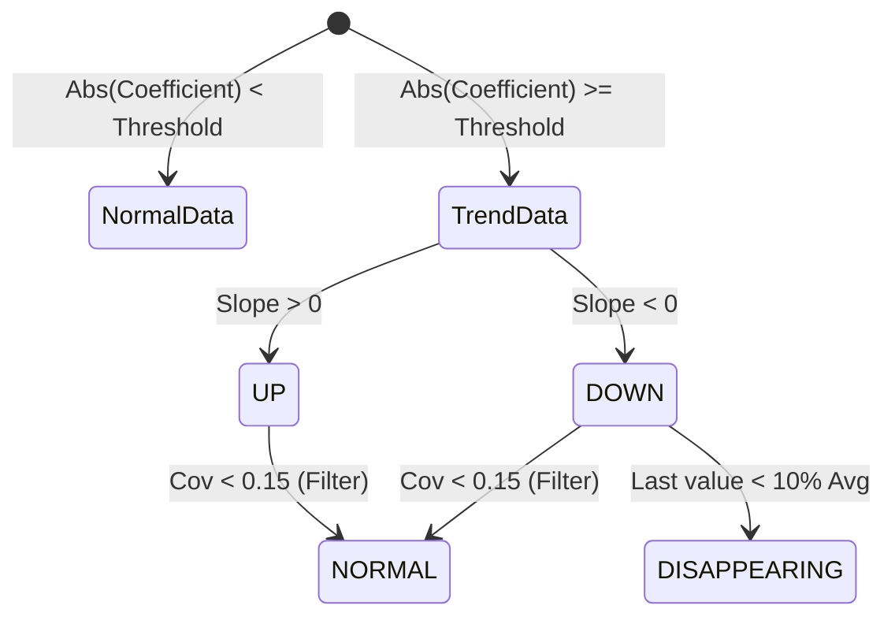

# Comprehensive Auto DQ Guide

> **Note:** All sensitive information (including company names, proprietary metrics, etc.) has been removed from this document. This is a purely technical guide detailing the algorithms, logic, and architecture of the system.

## 1. Overview
The Auto Data Quality (Auto DQ) framework is a robust system designed to automatically check and monitor data quality. Its primary goals are to reduce manual review efforts, identify tagging issues, and ensure high accuracy. The framework is built upon three main pillars: rule-based checkers, data trend monitors, and false alarm controls.

## 2. Auto DQ Tool Framework

### 2.1 Rule-Based Checkers
The system employs hundreds of rules across multiple domains and fields to catch tagging issues:
- **Mailbody Checker**: Identifies missing tags by using context and regex patterns. For example, it extracts missing total prices by matching currency symbols and digits near the "total" keyword.
- **Duplicate Order Checker**: Identifies duplicate records by matching key fields such as unique GUIDs, Total Price, Product Name, Purchase Date, and Email Time.
- **Price Checker**: Detects pricing anomalies such as missing tagging, wrong tagging (e.g., validating if `TotalPrice` is significantly larger than the sum of items and shipping), and extreme quantities (e.g., `qty > 10000`).
- **Other Checkers**: Covers long-tail cases, common sense validations, and custom on-demand checks.

### 2.2 Data Trends Monitor
Monitors timeline data across numerous fields to track data consistency over time. It triggers corrections when visually noticeable and unstable trends appear in the datasets.

### 2.3 False Alarm Control
Given the high volume of daily reports, it is critical to filter out noise and false alarms:

- **Rule Pre-filtering**: Limits the daily review sample size and skips known false positive patterns.
- **Similarity Scoring**: Uses algorithms like the Levenshtein ratio to compare new candidates against historical false alarms.
- **LLM Filter**: Leverages Large Language Models to evaluate specific fields (e.g., Order Numbers). The LLM is prompted to determine if the extracted structure matches known noise or true information, further reducing false positives.

## 3. Data Trend Analysis and Labeling
To analyze timeline-based data and filter out chaotic noise, the system uses a combination of trend simulation, fluctuation filtering, and business logic.

### 3.1 Trends Simulation (Linear Regression)
Evaluates the overall trend of the data by calculating a linear regression line:
- The timeline data is normalized to establish the relationship between the X-axis and the Y-axis.
- Statistical libraries (e.g., `scipy.stats.linregress`) are used to calculate the **slope** and **intercept** of the regression line.

### 3.2 Fluctuation Filtering
Filters out normal cyclical fluctuations using the **Coefficient of Variation (Cov)**.
- **Cov Calculation**: The ratio of the standard deviation to the mean (`Cov = std / mean`).
- **Cyclical Filtering**: If the daily Cov exceeds a set threshold, the data is aggregated into longer cycles (e.g., weekly). If the weekly Cov falls below the threshold, the trend is considered a normal cyclical fluctuation and is safely filtered out.

### 3.3 Trend Measurement and Categorization
Trends are categorized into states such as `UP`, `DOWN`, `NORMAL`, or `DISAPPEARING`:

- **Trend Coefficient**: Calculated as the ratio of `slope / intercept`.
- **Scale-based Logic**: Data sources are classified by volume scale (e.g., TINY, SMALL, MEDIUM, LARGE). Thresholds for the trend coefficient are adjusted dynamically—smaller sources require a larger coefficient to be flagged as an anomaly.
- **Disappearing Data**: Flagged if the most recent data point drops to 0 or falls drastically below the historical average (e.g., `< 10%` of the average).

### 3.4 Secondary Filtering (Business Logic Rejector)
Further reduces false positives by assessing data distribution:
- **Low Volume Rejection**: Excludes data with very low averages or insufficient daily counts.
- **Distribution Checks**: Rejects anomalies if the first and second halves of the timeline data have similar sums, or if recent averages are closely aligned with the historical mean.
- **Median Checks**: If data points are evenly distributed above and below the median, it often indicates normal noise rather than a structural anomaly.

## 4. ID Pattern Analysis
IDs are crucial for distinguishing orders and linking information across domains.
- **Pattern Generation**: Converts actual IDs like order number into regex patterns. For instance, a sequence of digits and letters is replaced with size-specific regex notations (e.g., `113-1234567` becomes `[0-9]{3}-[0-9]{7}`).
- **Anomaly Detection**: Generates representative samples for each regex pattern. By analyzing the frequency of these patterns, the system can systematically review and address any apparent tagging anomalies. Patterns are continuously refined to cover the majority of valid formats efficiently.

## 5. Future Roadmap
- **Enhanced LLM Integration**: Combining regex with LLM prompts for higher accuracy and reduced manual review.
- **Comprehensive Monitoring**: Integrating timeline data with broader insight data for advanced data trend monitoring.
- **Self-Serve Platform**: Evolving from providing fixed reports to a generalized data quality platform that allows users to configure custom rules dynamically.